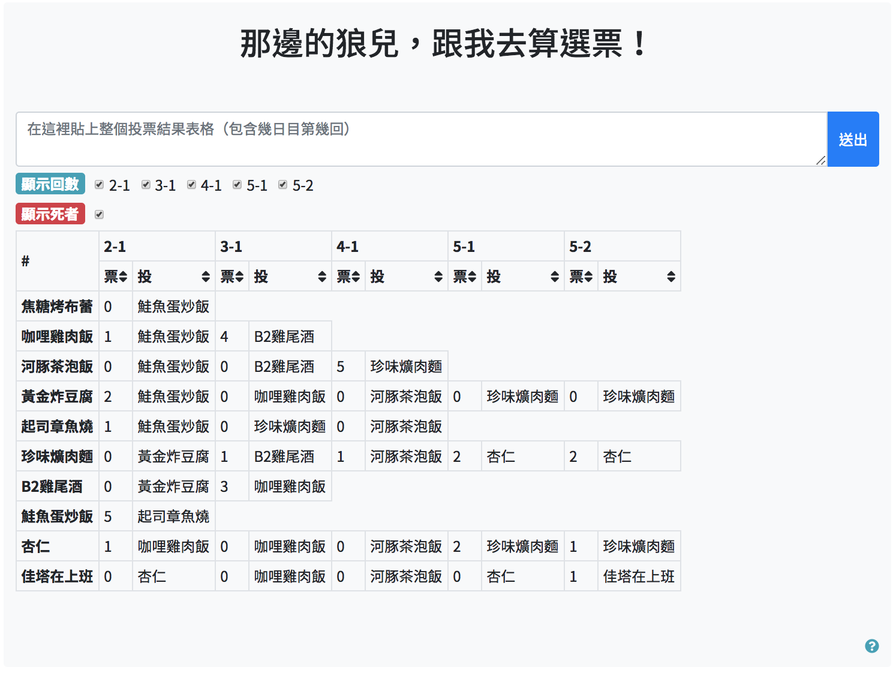
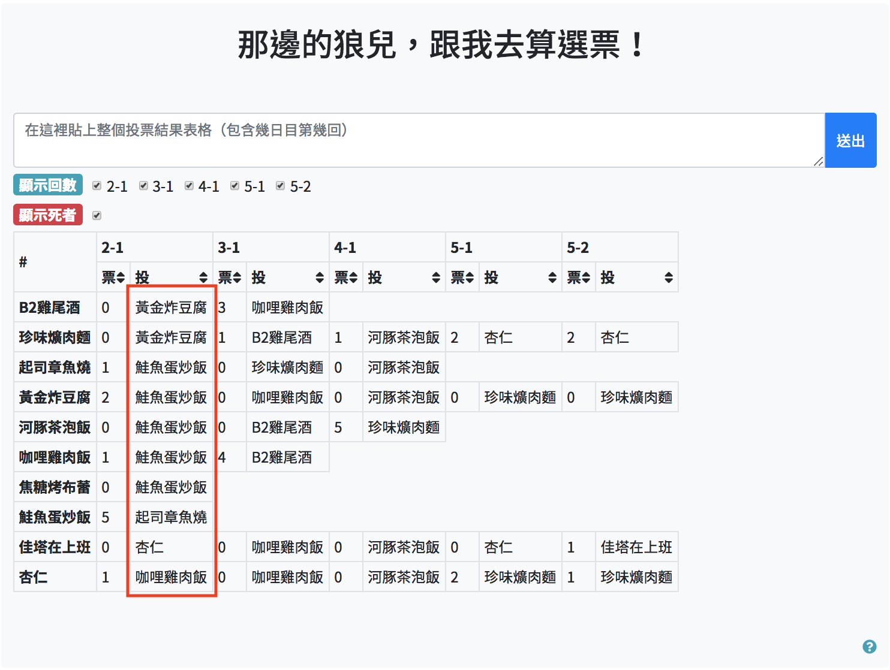
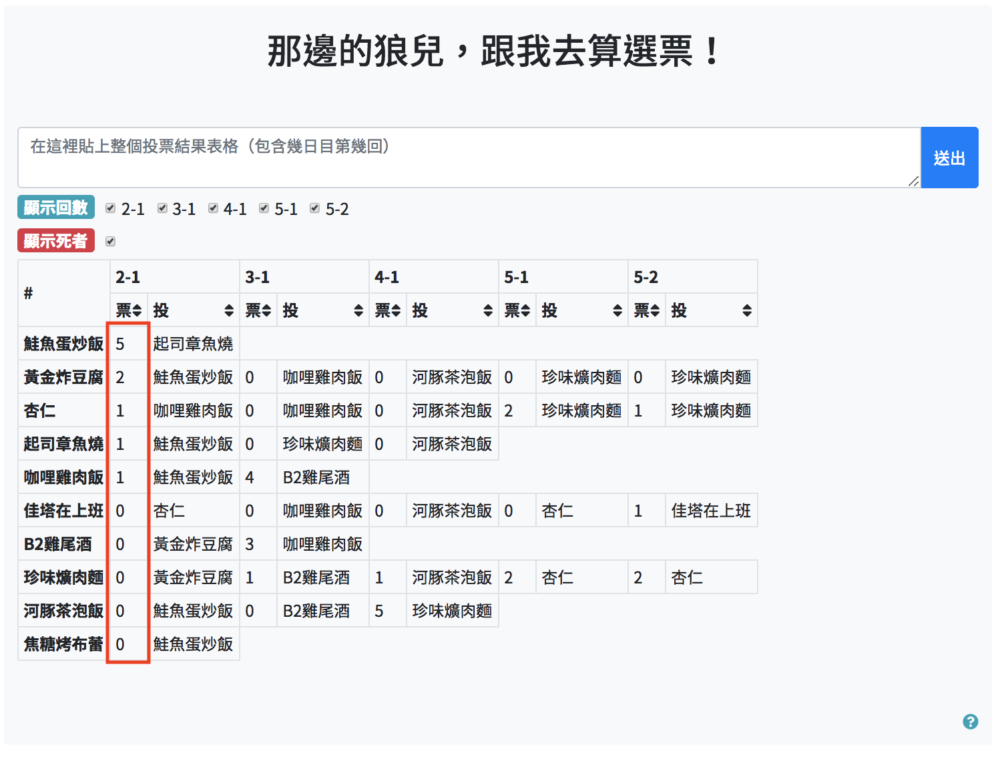
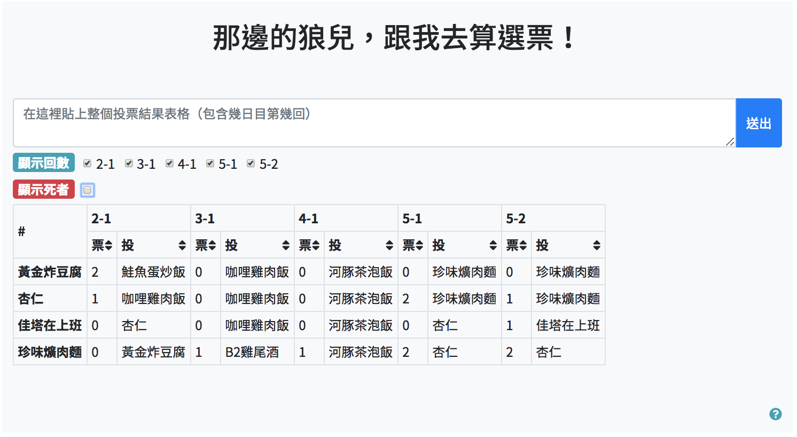
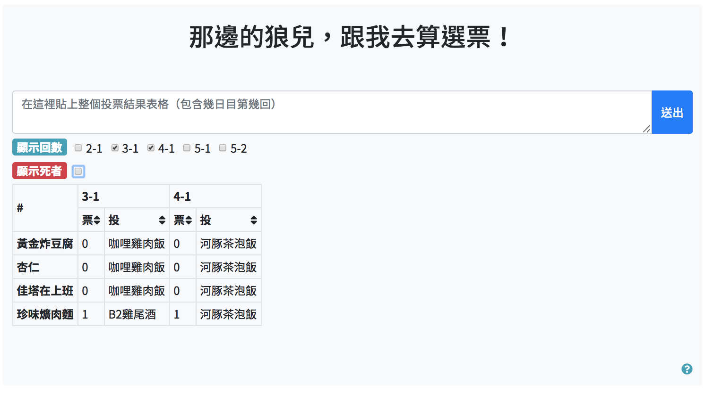

# Wolf-Voting-Calculator

網頁遊戲 [汝等是人是狼](https://diam.ngct.net/index.php) 的計票小工具。協助玩家觀察遊戲過程中的散投、集火等投票情形。

## 功能

- 匯入票單，並與記錄整合

  

- 依指定回合的投票對象，排序玩家

  

- 依指定回合的被投票票數，排序玩家

  

- 是否顯示死者

  

- 指定顯示回合

  

## 技術

- [Vue.js] - A JavaScript framework for building interactive web applications.
- [Bootstrap 4] - An HTML, CSS, and JavaScript framework.
- [Gulp] - A toolkit for automating and streamlining web development.

## 環境

請確定已經安裝好 node、npm 環境。

1. 確認安裝 Gulp 後，直接執行 `npm install`
2. 在專案目錄執行 `gulp`
3. 連線到  http://localhost:4000 即可

## Plugins

- [SweetAlert for Bootstrap](https://github.com/lipis/bootstrap-sweetalert) - A beautiful "replacement" for JavaScript's alert.

## Demo

 - 網址

     http://app.diam.nctu.me/

 - 測資（來源：[汝等是人是狼 - 66016村](https://diam.ngct.net/old_log.php?log_mode=on&room_no=66016&reverse_log=on) ）

     - 二日目第一回

       ```
       2 日目 ( 1 回目)
       焦糖烤布蕾	0 票	投票給 1 票 →	鮭魚蛋炒飯
       咖哩雞肉飯	1 票	投票給 1 票 →	鮭魚蛋炒飯
       河豚茶泡飯	0 票	投票給 1 票 →	鮭魚蛋炒飯
       黃金炸豆腐	2 票	投票給 1 票 →	鮭魚蛋炒飯
       起司章魚燒	1 票	投票給 1 票 →	鮭魚蛋炒飯
       珍味爌肉麵	0 票	投票給 1 票 →	黃金炸豆腐
       B2雞尾酒	0 票	投票給 1 票 →	黃金炸豆腐
       鮭魚蛋炒飯	5 票	投票給 1 票 →	起司章魚燒
       杏仁	1 票	投票給 1 票 →	咖哩雞肉飯
       佳塔在上班	0 票	投票給 1 票 →	杏仁
       ```


     - 三日目第一回

       ```
       3 日目 ( 1 回目)
       咖哩雞肉飯	4 票	投票給 1 票 →	B2雞尾酒
       河豚茶泡飯	0 票	投票給 1 票 →	B2雞尾酒
       黃金炸豆腐	0 票	投票給 1 票 →	咖哩雞肉飯
       起司章魚燒	0 票	投票給 1 票 →	珍味爌肉麵
       珍味爌肉麵	1 票	投票給 1 票 →	B2雞尾酒
       B2雞尾酒	3 票	投票給 1 票 →	咖哩雞肉飯
       杏仁	0 票	投票給 1 票 →	咖哩雞肉飯
       佳塔在上班	0 票	投票給 1 票 →	咖哩雞肉飯
       ```

     - 四日目第一回

       ```
       4 日目 ( 1 回目)
       河豚茶泡飯	5 票	投票給 1 票 →	珍味爌肉麵
       黃金炸豆腐	0 票	投票給 1 票 →	河豚茶泡飯
       起司章魚燒	0 票	投票給 1 票 →	河豚茶泡飯
       珍味爌肉麵	1 票	投票給 1 票 →	河豚茶泡飯
       杏仁	0 票	投票給 1 票 →	河豚茶泡飯
       佳塔在上班	0 票	投票給 1 票 →	河豚茶泡飯
       ```

     - 五日目第一回

       ```
       5 日目 ( 1 回目)
       黃金炸豆腐	0 票	投票給 1 票 →	珍味爌肉麵
       珍味爌肉麵	2 票	投票給 1 票 →	杏仁
       杏仁	2 票	投票給 1 票 →	珍味爌肉麵
       佳塔在上班	0 票	投票給 1 票 →	杏仁
       ```

     - 五日目第二回

       ```
       5 日目 ( 2 回目)
       黃金炸豆腐	0 票	投票給 1 票 →	珍味爌肉麵
       珍味爌肉麵	2 票	投票給 1 票 →	杏仁
       杏仁	1 票	投票給 1 票 →	珍味爌肉麵
       佳塔在上班	1 票	投票給 1 票 →	佳塔在上班
       ```
